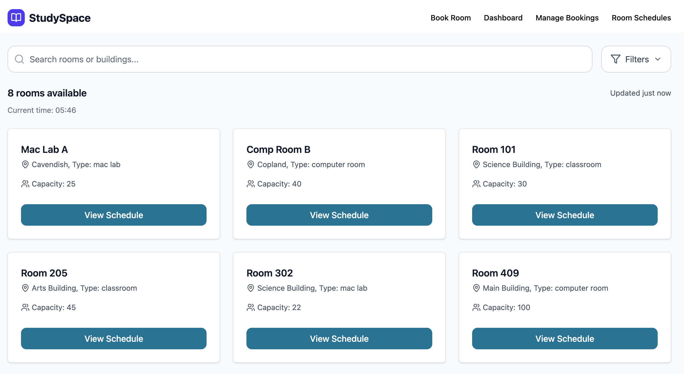

# StudySpace

## Live Demo: (https://studyspace11.netlify.app)

**StudySpace** is a private web application built to help university students quickly find available, empty classrooms for studying — especially when libraries are full. It ensures students and staff can access real-time room availability filtered by time, building, and schedule.

- Tech: Next.js, TypeScript, Supabase, Tailwind CSS

## Features

- Real-time room availability by time and building
- Room search that shows room schedule 
- Secure auth with Supabase (email/password)
- Room booking and management for students
- Admins accept/deny booking

## Screenshots

This project is based on the Nextbase NextJS Supabase Starter by @imbhargav5.
